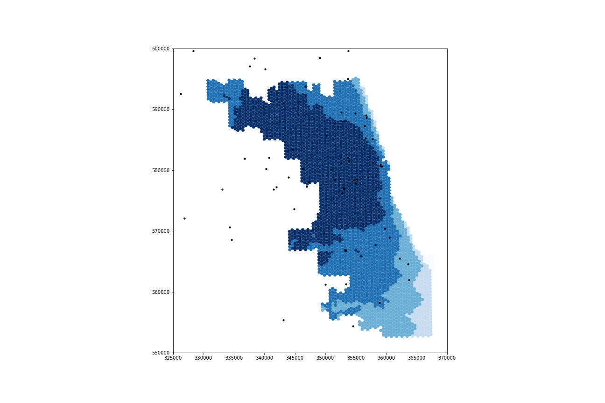
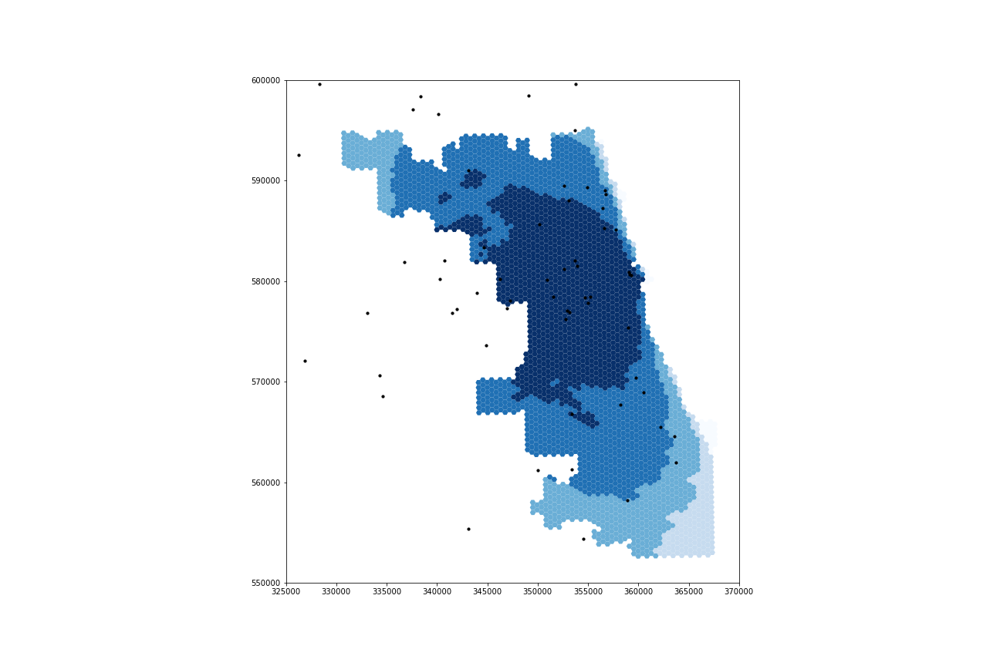

## Introduction
In *Rapidly Measuring Spatial Accessibility of COVID-19 Healthcare Resources: A Case Study of Illinois, USA*, Kang et al. use the Enhanced Two-Step Floating Catchment Area (E2SFCA) method with parallel processing to assess the accessibility of ICU beds and ventilators to vulnerable populations -- defined as individuals of 50 years of age or older -- and COVID-19 patients in Illinois.
The goal of their study was to provide policymakers with regularly updated information concerning the spatial capability of key treatment resources to COVID-19 patients and vulnerable populations.
The authors found that access to ventilators and ICU beds was unevenly distributed throughout Illinois, and they published updated analyses daily in an online, interactive webpage called [WhereCovid](https://wherecovid19.cigi.illinois.edu/spatialAccess.html#7/40.000/-89.000/Dark_Mode-il_acc_i/370).

We seek to reproduce Kang et al.'s study for a few reasons.
First, the global pandemic is a pressing issue, and public policy decisions regarding the pandemic ought to be based upon reputable research.
Reproducing this study either confirms its findings, contributing to its validity as a basis for public policy, or overturns its findings, improving the basis of knowledge from which the government designs public policy.
There are also intellectual and pedagogical motives for conducting a reproduction of this study.
Intellectually, a reproduction confirms the validity of the researchers' spatial techniques; and pedagogically, conducting a reproduction allows students to see how geospatial studies are conducted and encourages students think critically about their reputability.

## Materials and Methods
The Kang et al. study draws on four datasets:
1. A **hospital dataset** provided by the Illinois Department of Health, which contains information about the number of ICU beds and ventilators at each hospital.
2. A **COVID-19 dataset** also provided by the Illinois Department of Health, with information regarding the number of COVID-19 cases in each Zip Code in the state.
3. A **residential dataset** from the 2018 American Community Survey 5 year table detailing the population and demographic composition of each tract in Illinois.
4. A **road network dataset** queried from OpenStreetMap using the Python package, OSMnx.

The provided research notebook includes only the data for the City of Chicago, because it is computationally burdensome for users to conduct this reproduction on the entire state of Illinois.
In order to deal with boundary issues (i.e. sometimes the fastest route to a hospital in Chicago uses streets outside the city), the road network provided for reproduction extends 15 miles past the boundaries of Chicago.
However, the population data provided by the authors contained information exclusively for the tracts within Chicago.
Residents of the Chicago suburbs can, and likely do, take advantage of the services provided by the hospitals physically within the city.
For this reason, we know that a more accurate analysis would incorporate population information of Chicago's suburbs.

In our class's reproduction of this analysis, we seek to remedy this issue by extending the pool of demographic information to include the tracts in all of the counties neighboring Cook county, which is the county where Chicago is located.
We did not address the geographic extent of the COVID-19 case data.

The computational resources available for the original study and our reproduction included a CyberGIS server and the programming language Python.
Specifically, the study was conducted in a Jupyter notebook using the virtual computing environment, CyberGISX, a cyberinfrastructure project which performs computations on a bank of supercomputers at the University of Illinois Urbana-Champaign.
Required Python packages include numpy, pandas, geopandas, networkx, OSMnx, shapely, matplotlib, tqdm, and multiprocessing.

***(((incorporate value of Open Source GIScience/complementing the original authors)))
(((comment code)))
Derrick's notes 6***

## Results and Discussion

You can find my complete reproduction repository [here](https://github.com/Liam-W-Smith/RPr-Kang-2020).
Our additions to the code can be found in [/procedure/code/04-Class-Reanalysis.ipynp](https://github.com/Liam-W-Smith/RPr-Kang-2020/blob/main/procedure/code/04-Class-Reanalysis.ipynb) under the "Population and COVID-19 Cases Data by County" subheading and our new figures are under [/results/figures/reproduction](https://github.com/Liam-W-Smith/RPr-Kang-2020/tree/main/results/figures/reproduction).

## Conclusions
