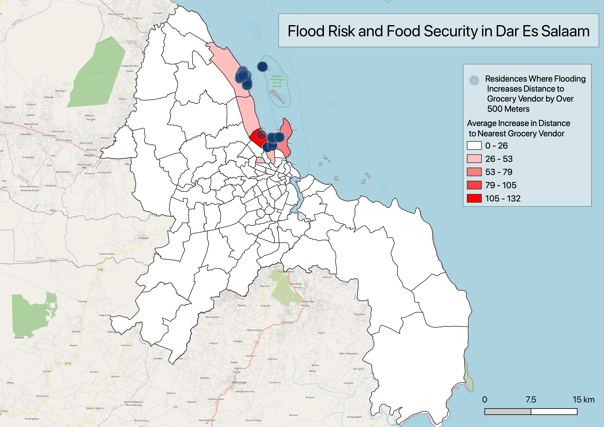
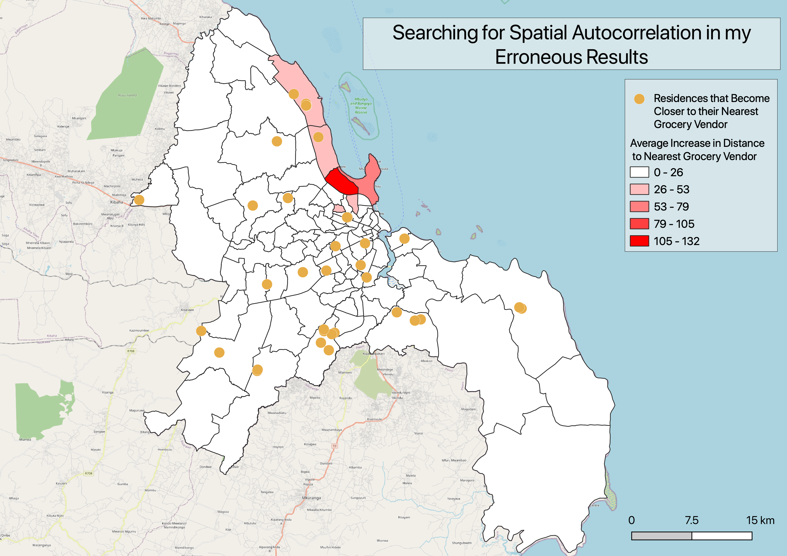

Liam Smith, Middlebury College

Version 1.0 | Created 2021-10-07 | Last Updated 2021-10-13  

## Abstract

This analysis assessed the extent to which residences in Dar Es Salaam, Tanzania, would lose access to food sources in the case of a severe flooding event.
Specifically, I conducted a distance analysis on PostGIS to determine how much the distance from every residence in Dar Es Salaam to the nearest grocery vendor would increase between an everyday scenario and a severe flood scenario.
The results revealed that flooding has minimal impact on food accessibility, except for in a few small regions.
Of the 1,292,622 residences in Dar Es Salaam, only 1,317 of them would be over 500 meters further from a non-flooded grocery vendor in the event of severe flooding.

## Important Links
- [Research Compendium](https://github.com/Liam-W-Smith/Dar-Es-Salaam-Resilience)
- [Interactive Map of my Results in Dar Es Salaam](index.html)

### Keywords

Dar Es Salaam, food security, distance, flood, vulnerability

## Study design

The following analysis is an exploratory study addressing the impacts of extreme flooding on food accessibility in Dar Es Salaam, Tanzania.
The spatial extent of the study is the city of Dar Es Salaam, Tanzania.
I conducted this analysis on a household-level spatial scale, and I aggregated this information to the wards level to summarize my results.
The analysis was conducted based on flood projections and Open Street Map data as of October, 2021.
Thus, the temporal extent of the study is limited to 2021, or more realistically, when the features were digitized in OSM up until 2021.

## Materials and procedure

### Data and variables

[OpenStreetMap](https://www.openstreetmap.org/#map=11/-6.8160/39.1601) is a worldwide open source mapping project, which served as the source of the planet_osm_point and planet_osm_polygon layers used in this analysis.
I found the locations of all of the residences and grocery vendors in Dar Es Salaam using this data source.

[Resilience Academy](https://resilienceacademy.ac.tz/) is an organization which brings several universities in Tanzania together to educate youth about mapping, develop community maps, and assess climate risks.
The Resilience academy served as the source of my wards and flood_scenario layers, which provided information about the location and geometry of governmental subdivisions and potential floods in Dar Es Salaam.

### Geographic characteristics

This analysis is based on the locations of wards, grocery vendors and residences in Dar Es Salaam, as well as the projections of where flooding may occur.
The locations of grocery vendors and residences are open data taken from OpenStreetMap.
As such, the locations have been added over the past couple of years, so they may not all be up to date.
Additionally, they were added to the OpenStreetMap database by a variety of users, and may not be entirely accurate.
The locations of different wards are defined by the government and unlikely to have much error.
It is difficult to discern the accuracy of the flood_scenarios, as they are exactly as accurate and precise as the data providers, Resilience Academy, could make them.
Resilience Academy generated the layer using reports of historic floods, so its accuracy depends on the quality of elevation models and the accurate memory of those reporting past flood events.
I used a coordinate reference system of ESPG: 32737, and the spatial extent of the analysis is the land area of the city of Dar Es Salaam.

### Data transformations

In order to perform an analysis on the accessibility of grocery vendors to residences in flooded and not-flooded scenarios, I first had to manipulate the given data to make such comparison possible.
The first step was to identify the points and polygons in the OpenStreetMap database that represented food vendors, which I accomplished with the following code:
``` sql
CREATE TABLE foodpoints2 AS
SELECT name, amenity, shop, osm_id, way
FROM planet_osm_point
WHERE amenity = 'marketplace' OR shop IN ('convenience', 'supermarket', 'kiosk', 'bakery', 'butcher', 'greengrocer', 'pastry');

CREATE TABLE foodpolygons AS
SELECT name, amenity, shop, osm_id, way
FROM planet_osm_polygon
WHERE amenity = 'marketplace' OR shop IN ('convenience', 'supermarket', 'kiosk', 'bakery', 'butcher', 'greengrocer', 'pastry');
```

These queries generated two separate tables of the grocery vendors in Dar Es Salaam: one where these sites were recorded as points and one where they were recorded as polygons.
In order to convert the polygon features to point features and combine all of the information into one data table, I used the following query:
``` sql
CREATE TABLE foodsources AS
SELECT name, osm_id, st_transform(way, 32737)::geometry(point, 32737) AS geom FROM foodpoints2
UNION
SELECT name, osm_id, st_transform(st_centroid(way), 32737)::geometry(point,32737) AS geom FROM foodpolygons;
```

I conducted three analogous queries to extract the residences from the OSM data:

```sql
CREATE TABLE residencepoints2 AS
SELECT building, osm_id, way
FROM planet_osm_point
WHERE building IN ('residential', 'yes');

CREATE TABLE residencepolygons AS
SELECT building, osm_id, way
FROM planet_osm_polygon
WHERE building IN ('residential', 'yes');

CREATE TABLE residences AS
SELECT osm_id, st_transform(way, 32737)::geometry(point, 32737) AS geom FROM residencepoints2
UNION
SELECT osm_id, st_transform(st_centroid(way), 32737)::geometry(point,32737) AS geom FROM residencepolygons;
```

Later on in my analysis, it will be helpful to know which ward each residence is located within.
I joined the ward information to my table of residences as follows.
```sql
ALTER TABLE residences
ADD COLUMN ward text;

UPDATE residences
SET ward = wards.ward_name
FROM wards
WHERE st_contains(wards.utmgeom, residences.geom);
```

I also needed to perform a few operations in order to prepare my flood scenario data for comparison with grocery vendors.
Specifically, I needed to fix the geometry of the flood layer and dissolve the polygons into one feature.

```sql
UPDATE flood
SET geom = st_makevalid(geom);

CREATE TABLE flooddissolve AS
SELECT st_union(geom)::geometry(multipolygon,32737) as geom
FROM flood;
```

### Analysis

With the appropriate data transformations complete, I was ready to conduct the spatial analysis relevant to my question.
I began by calculating the distance from every residence to the nearest grocery store in a not flooded scenario.
```sql
CREATE TABLE foodaccess AS
SELECT residences.*, st_distance(a.foodsourcesgeom, residences.geom) AS dist
FROM residences CROSS JOIN lateral (
	SELECT foodsources.geom AS foodsourcesgeom
	FROM foodsources
	ORDER BY foodsources.geom <-> residences.geom
	LIMIT 1) a;
```

In order to do the same for a flooded scenario, I first needed to find the food sources that were located within the flood zones and create a table involving the food source that were NOT flooded.

```sql
CREATE TABLE foodflood AS
SELECT foodsources .*, st_multi(st_intersection(foodsources.geom, flooddissolve.geom))::geometry(multipoint, 32737) as geom2
FROM foodsources INNER JOIN flooddissolve
ON st_intersects(foodsources.geom, flooddissolve.geom);

ALTER TABLE foodflood
DROP COLUMN geom;

CREATE TABLE alt_foodnotflood AS
SELECT *
FROM foodsources
WHERE osm_id NOT IN (SELECT osm_id FROM foodflood);
```

With that information in hand, I was prepared to calculate the distance from every residence to the nearest grocery vendor in the event that some grocers were flooded by a severe storm.
```sql
CREATE TABLE foodaccess_flood AS
SELECT residences.*, st_distance(a.alt_foodnotfloodgeom, residences.geom) AS dist
FROM residences CROSS JOIN lateral (
	SELECT alt_foodnotflood.geom AS alt_foodnotfloodgeom
	FROM alt_foodnotflood
	ORDER BY alt_foodnotflood.geom <-> residences.geom
	LIMIT 1) a;
```

In order to summarize the effects of flooding on food access in each ward, I grouped the food access tables for both scenarios by ward and calculated the average distance to the nearest grocery store from the individual distances.
I then created a new table which illustrates the change in average distance to the nearest grocery vendor for each ward.

```sql
CREATE TABLE foodaccess_wards AS
SELECT ward, avg(dist)
FROM foodaccess
GROUP BY ward;

CREATE TABLE foodaccess_flood_wards AS
SELECT ward, avg(dist)
FROM foodaccess_flood
GROUP BY ward;

CREATE TABLE change_in_access_wards AS
SELECT foodaccess_flood_wards.ward, foodaccess_flood_wards.avg AS flood_avg_dist, foodaccess_wards.avg AS normal_avg_dist, foodaccess_flood_wards.avg - foodaccess_wards.avg AS change_avg_dist
FROM foodaccess_flood_wards LEFT JOIN foodaccess_wards
ON foodaccess_flood_wards.ward = foodaccess_wards.ward;
```

In order to map this information, I needed the geometry of the wards!
For this reason, I joined the change in average distance from change_in_access_wards back to the wards table.
```sql
ALTER TABLE wards
ADD COLUMN change_avg_dist REAL;

UPDATE wards
SET change_avg_dist = change_in_access_wards.change_avg_dist
FROM change_in_access_wards
WHERE wards.ward_name = change_in_access_wards.ward;
```

Upon visualizing this information, I realized that my results would be better illustrated if I included the locations of the most impacted residences.
For this reason, I calculated the change in distance for every residence in Dar Es Salaam and extracted just the residences where the distance increased by over 500 meters.

```sql
CREATE TABLE change_in_access AS
SELECT foodaccess_flood.osm_id, foodaccess_flood.geom, foodaccess_flood.dist AS flood_dist, foodaccess.dist AS normal_dist, foodaccess_flood.dist - foodaccess.dist AS change_dist
FROM foodaccess_flood LEFT JOIN foodaccess
ON foodaccess_flood.osm_id = foodaccess.osm_id;

CREATE TABLE meters_500 AS
SELECT *
FROM change_in_access
WHERE change_dist > 500;
```

## Results

My analysis found the average distance from residences in each ward to the nearest grocery vendor in both flooded and not flooded scenarios, and then calculated the change in average distance between the two scenarios.
The average change in distance from residences to grocery vendors in the event of a severe storm is summarized in the table below.

Ward Name	| Average Change in Distance (meters)
------------: | :------------
Mikocheni	| 131.58932
Msasani	| 64.51961
Tandale	| 37.49041
Kunduchi	| 36.18561
Kawe	| 31.273449
Mwananyamala	| 27.822485
Mchikichini	| 23.75622
Kigogo	| 15.701152
Kijitonyama	| 12.482358
Vingunguti	| 12.239834
Kipawa	| 12.238578
Mabibo	| 12.136148
Mburahati	| 12.103266
Mnyamani	| 9.815187
Ndugumbi	| 8.90767
Toangoma	| 8.585486
Makumbusho	| 8.519193
Manzese	| 6.9478526
Kisukuru	| 4.9237847
Kilakala	| 4.7144012
Ubungo	| 4.442788
Makurumla	| 3.5472274
Sinza	| 2.9656193
Makuburi	| 2.868142
Jangwani	| 2.5149345
Azimio	| 1.8910844
Buguruni	| 1.8025422
Mbagala	| 1.7731322
Makongo	| 1.6470727
Kariakoo	| 1.4873677
Hananasifu	| 1.2613049
Magomeni	| 1.0028378
**ALL OTHERS**	| **< 1**

As the table reveals, the average distance in each ward increases by over 25 meters in only 6 wards.
Furthermore, the meters_500 table wound up with a feature count of just 1,317.
This means that of the 1,292,704 residences in Dar Es Salaam, only 1,317 of them experience an increase in the distance to the nearest grocery store of over 500 meters in the case of an extreme flood.

The following choropleth map reveals the locations of these 1,317 residences and illustrates the cumulative impact of flooding on grocery store proximity in each ward.
It is interesting to note that the residences experiencing the worst food access impacts of flooding appear to be concentrated in three main areas, all of which lie near the shore at the northern end of the city.



Please also see this [interactive map of my results](index.html) and hover your mouse over different residences and wards to see exactly how flooding would impact different households and regions within Dar Es Salaam.

## Discussion

While one might expect severe flooding to impede residents' access to food, this analysis reveals that the impact is actually quite limited in Dar Es Salaam.
In fact, just 1,317 residences which would see the distance to the nearest grocery vendor increase by over 500 meters and the greatest change for any one residence would be 1434 meters.
These 1,317 residences represent a tiny fraction, *just 0.1%*, of the residences in Dar Es Salaam.
Furthermore, 500 meters is a little under a third of a mile and 1434 meters is not even a mile, so even the 0.1% most impacted residences would experience relatively minor impacts on food accessability.

These impacts are diminished even further when residential data is aggregated to the ward level.
My analysis found that 62 of the 95 wards would witness an increase in average distance of less than 1 meter, revealing that residents' access to food in large swaths of the city is left largely untouched.
With just 6 wards witnessing an increase in the the average distance of over 25 meters and the maximum change being 131.6 meters, it is clear that no single ward would experience a particularly damaging loss of food accessibility.
This is great news for the city of Dar Es Salaam!
They appear to have developed a resilient food distribution network that can provide for citizens even during cases of extreme flooding, and this network appears to be regionally equitable, since most wards experienced similar levels of impact.

One of the reasons why residences can access food reliably during times of flooding may simply be the prolific number of grocery vendors in the city.
With little cornerstores in most neighborhoods, there are almost 14 thousand grocery vendors in Dar Es Salaam.
For this reason, even when a significant portion of them, 1152 in my analysis, are flooded, residences still have other grocers relatively nearby.

One limitation of my analysis may be the aggregation to the ward level.
As the points on my map illustrate, there are a few smaller subregions where the impacts are more strongly felt.
Professor Holler identified one of these regions as the fishing district.
Unfortunately, the size of the wards are such that the effects in the regions most impacted by flooding are dampered by the other residences in their respective wards.
Perhaps a subward or neighborhood level analysis would be more telling of the impacts of flooding in individual communities.

I also noticed a strange error in my final results.
There are 40 residences in Dar Es Salaam for which the distance to the nearest grocery vendor actually *decreased* in the flood scenario.
This should be impossible, given that the flood eliminates, rather than creates, grocers.
I selected these 40 residences and visualized them on my map as shown below.



Curiously, these points appear somewhat randomly distributed around Dar Es Salaam, demonstrating no evidence of spatial autocorrelation.
This leads me to believe that the mistake is on the computational rather than theoretical side of my analysis, since nearby households should experience similar changes in distance to grocery vendors.
Perhaps the way I calculated distance is prone to errors -- I am not sure.
This error ought to be further investigated in order to assess the validity of my results and the accuracy of the method I used to calculate distances.

## Conclusions

Fortunately, Dar Es Salaam's food network appears to be quite resilient in the face of extreme flooding.
More broadly, cities with widely distributed food networks may fare better during floods.
Where I live in the USA, large swaths of the population tend to shop at a select few supermarkets.
If a couple of supermarkets were to flood, entire communities would lose access to nearby grocery stores.
In this manner, the food distribution network of Dar Es Salaam is far more resilient to flood risk than the food networks here at home.
I suspect that the grocery patterns I am accustomed to are typical of developed nations and the grocery patterns of Dar Es Salaam are typical of developing nations.
It would be beneficial for researchers to conduct similar analyses in other major cities of developing nations and contrast those with analyses in major cities of developed nations in order to further assess this relationship.
Perhaps developed countries should be looking to the widely distributed grocery systems of developing countries as examples for how we can minimize our own climate vulnerabilities.
