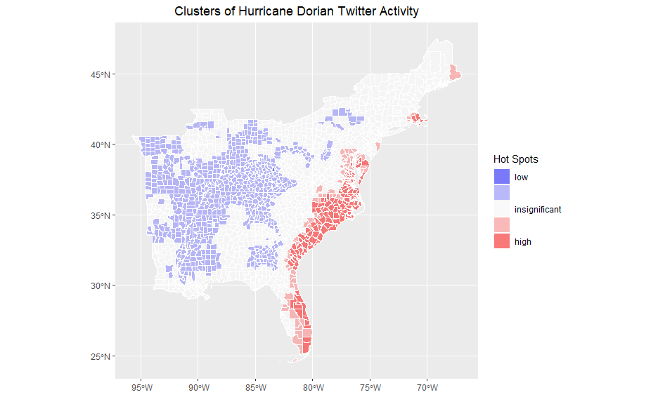

Did you know that the USGS can now identify earthquakes using live Twitter data as quickly as or quicker than they can by using traditional methods of seismic detection?
Volunteered Geographic Information (VGI), like information gathered from Twitter, is rapidly emerging as a powerful tool for responding to and learning from natural disasters.
But as Crawford and Finn articulate in *The limits of crisis data: analytical and ethical challenges of using social and mobile data to understand disasters*, certain ethical dilmmas and uncertainties emerge from VGI.
In this blog post, I'll discuss the findings of last week's [analysis of Twitter data during Hurricane Dorian](https://gis4dev.github.io/2021/11/11/twitter-hurricane) in the context of Crawford and Finn's paper.

Professor Holler's analysis of Twitter data during Hurricane Dorian sought to identify how Twitter activity was affected by Hurricane Dorian and the fake news "sharpiegate" scandal.
In this project, he queried for Tweets containing the words "hurricane", "dorian", and "sharpiegate", and used the resulting data to conduct a geographic, temporal, and word-association analysis of the data.
The methodology was robust, but due to the nature of Twitter data, the results were subject to several uncertainties.

**Defining Disasters**
One of the issues presented by Crawford and Finn relates to the way we define disasters.
While natural disasters occur over a discrete timeframe of a few days, the human impacts of these disasters persist for years.
For this reason, the intellectual work surrounding natural disasters ought to account for both their short and long term impacts.
Twitter queries, however, are confined to a particular timeframe, which inherently neglects the reasons that a community was susceptable to the disaster and the long term consequences of that disaster.
Twitter activity about disasters also tend to be reactionary, peaking during the event and dying off in the following days.
This phenomenon in the case of Hurricane Dorian is illustrated by the figure below.
Since Twitter activity about the storm dies off in the days following the event, it is impossible for a researcher to analyze anything other than people's short term reactions to the event.

Similarly, our search terms determine our data, and we may not always pick the right words.
In the Hurricane Dorian analysis, all of the tweets explicitly contained the words "hurricane", "dorian", or "sharpiegate", but there must have been tweets about the hurricane that did not contain those words specifically.
For example, a tweet containing the words "flooding" and "wind" could have been about the hurricane, but it would not have been included under our methodology.
On the other hand, including "flooding" and "wind" as search parameters could have also introduced our analysis to tweets about distinct flood and wind events.
Our search parameters, whatever they may be, establish a certain abstraction from reality which will never match perfectly with the true situation.

**Who Contributes to VGI?**
Another issue with using social media data to respond to natural disasters is the fact that social media users are not representative of the entire population.
They tend to be younger, live in urban areas, and have access to a smartphone and the internet.
In contrast, older, poorer, and more rural communities are not well represented.
I wonder how the Hurricane Dorian analysis was influenced by urban/rural distinctions and demographic characteristics.
The map below reveals that the coast was a hotspot of Twitter activity and inland areas were hotspots of inactivity.
This makes sense given that Hurricane Dorian hit the East Coast, but could the results have been exacerbated by the more urban nature of the coast?

**The Twitter Environment: Algorithms and Bots**
Crawford and Finn also raise concerns about the affects of Twitter's algorithms on our analyses.
Whether or not an individual finds a post on their feed is a function of Twitter's algorithms.
For this reason, network analyses reflect not just how users interact with each others posts, but also how Twitter's algorithms influnce these interactions.
Bots introduce more uncertainty to social media environments.
For example, about 9% of Twitter users are bots, which are responsible for large volumes of tweets.
A researcher cannot easily discern between a bot's account and a human's account, so our analyses wind up reflecting some combination of human and robotic content.

People may also use twitter differently in different cultural and regional contexts.
Researchers, who tend to work at prestigious universities and large corporations, are often far removed from the center of disaster, and may have a poor understanding of the region's internet culture.
It is difficult for an outsider to understand all of the factors at play, and even more difficult to parse out different regional tendencies in an analysis conducted on a large study area.

**Ethical Considerations**
Unfortunately, the use of VGI also raises concerns regarding privacy and consent.
The crux of the issue is that when faced with a life-threatening disaster, people often request help online and provide personal information about location, family members, and medical needs.
When one's situation is so dire, one doesn't care how their data might be exploited in the future: they just want to survive.
But their privacy does matter, and it is unethical for researchers to publish any personal information that could be linked to a particular individual.

Unfortunately, this situation occurs relatively frequently, as we saw relating to Hurricane Harvey in class.
In the aftermath of Harvey, the emergency response system broke down and a group of citizens rose in its palce.
These citizens organized a system in which people could request help on social media and a volunteer with a boat would come to provide assistance.
Every request for assistance was compiled in a google document, which was available online.
This google doc, which contained sensitive information about people's locations and medical issues, could have been exploited in criminal and malicious manners, and several news outlets exacerbated the issue by publishing stories about it online.

In the case of Twitter data, Twitter prohibits researchers from publishing unaggregated data and from separating geographic information from the Tweets to be used for other purposes.
While it's great to tell researchers to follow these guidelines, there is no way to ensure that people actually will follow the rules.

At the end of the day, VGI such as Twitter data can provide tremendous assistance in analyzing and developing responses to natural disasters, but this data comes with limitations.
We must be aware of the uncertainties and biases present in VGI and careful not to misuse data in a way that violates one's right to privacy.

**References:**
- Crawford, K., & Finn, M. (2015). The limits of crisis data: Analytical and ethical challenges of using social and mobile data to understand disasters. GeoJournal, 80(4), 491–502. https://doi.org/10.1007/s10708-014-9597-z
- Professor Holler's [Research Compendium](https://github.com/GIS4DEV/OR-Dorian) for his analysis of Hurricane Dorian
