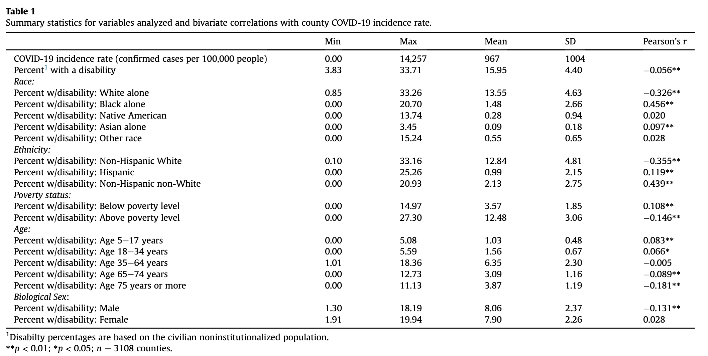
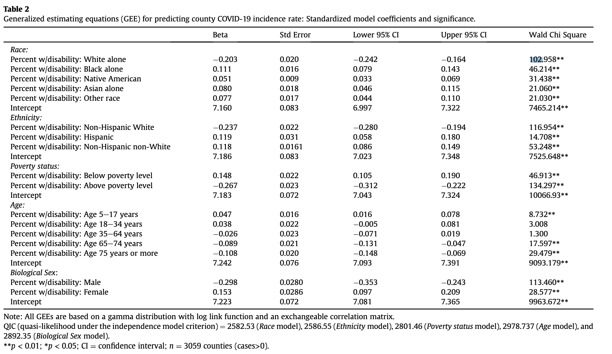
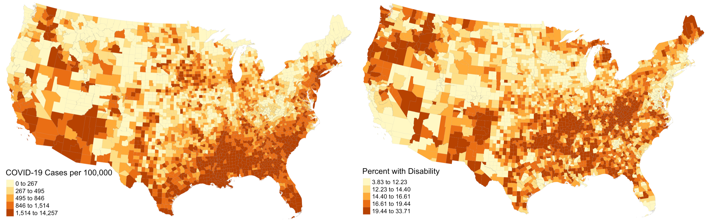

## Chakraborty's Work

In *Social inequities in the distribution of COVID-19: An intra-categorical analysis of people with disabilities in the U.S.*, Jayajit Chakraborty conducts "the first national scale study of the relationship between COVID-19 incidence and disability characteristics in the U.S."
His goal is to determine whether there is a relationship between COVID-19 prevalence and high concentrations of people with disabilities (PwDs), particularly socio-economically disadvantaged PwDs, categorized by:
- Race
- Ethnicity
- Poverty status
- Age
- Biological sex

His work draws on two data sources:
1. County level COVID-19 statistics from Johns Hopkins -- both totals and cases per 100,000.
2. 2018 American Community Survey data -- PwD counts categorized by race, ethnicity, poverty status, age, and biological sex, fromm which Chakraborty calculates rates.

To address his question, Chakraborty applies two statistical techniques.

**First**, he calculates bivariate Pearson correlation coefficients in order to quantify the correlations between COVID-19 prevalence and each disability.
Like other statistical techniques describing correlations, bivariate Pearson corrrelation coefficients are all calculate on a scale from -1 to 1, where -1 indicates a perfect negative relationship, a 0 indicates no relationship, and a 1 indicates a perfect positive relationship.
Chakraborty's results are displayed in the following figure, copied from his paper.

As you can see, most r-values are close to 0, indicating relatively weak correlations, yet many of these correlations are statistically significant with small p-values.
This is a strange dichotomy, which seems somewhat unrealistic.
Note that we are using a massive dataset, and we can almost always find something that is "statistically significant" if we look at enough data points.

In the table, it appears that traditionally advantaged subsets of PwDs, like men, non-Hispanic White people, and people above the poverty level tend to have exhibit slightly negative correlations; traditionally disadvantaged subsets of PwDs, like women, Black people, and impoverished people tend to exhibit slightly positive correlations.
Given what we already know about the COVID-19 pandemic, this makes sense.
Marginalized communities tend to have inadequate access to healthcare resources, live in more crowded housing conditions, and work in essential fields at higher rates than the general population, all factors which increase their risk of catching COVID-19.   

**Second**, Chakraborty uses General Estimating Equations (GEEs) to adjust for spatial autocorrelation when examining the correlations between his predictor and response variables.
To calculate a GEE, one must first define spatial clusters of observations.
GEEs generate correlation coefficients, much like the Pearson's r, under the assumption that observations within a cluster are correlated and observations in different clusters are independent.
Chakraborty categorizes counties into different clusters based on two factors:
1. The state in which they are located.
This makes sense because different states implemented different COVID-19 policies, so the conditions causing varying disease prevalence vary between states.
2. The Relative Risk (RR) for COVID-19 incidence, defined as RR = ((local COVID-19 cases)/(local pop))/((US COVID-19 cases)/(US pop)).
He classified counties into 6 categories based on their RR levels.
But before categorizing counties based on their RR levels, he applied Kulldorf Spatial Scan Cluster Detection in order to determine clusters of counties where COVID rates were highly correlated.
Counties outside of a cluster were assigned the lowest category of RR rates and the center county in each cluster received an RR score based on the counties in its cluster.

Classifying counties based on those two factors, Chakraborty created a total of 102 clusters, which included between 1 and 245 counties.
Applying GEEs to his data, Chakraborty generated the following table of results, which overall were relatively similar to the previous results.

## Our Reproduction

In lab we reproduced Chakraborty's work using a research compendium put together by Professor Holler and his research assistants.
Our research repository can be found [here](https://github.com/Liam-W-Smith/RPr-Chakraborty-2021).

The first step was to reproduce *figure 1* from his paper, which illustrated the prevalence of COVID-19 cases on the county level across the USA.
Once we obtained the appropriate data, this was a fairly simple task and our map looked practically identical to his; we even used the same classification and color schemes!
As an addition to his work, we also mapped disability rates around the country.
His paper was relatively light on visuals, and including a map of disability rates provides important context when analyzing spatial patterns of COVID-19 and disability characteristics.
Notice how there is a distinct region in the southeast and southwest where COVID-19 prevalence and disability rates are both high.
In other parts of the country, high rates of both factors rarely intersect.

The second step was to reproduce Chakraborty's statistical analysis with Pearson correlations.
Upon implementing this methodology in R, we found results that are relatively consistent with his.
The exact values varied slightly (maximum difference between our r-values and his was .006), but the conclusions we draw from our results are the same.
However, we did realize that Pearson's R is an inappropriate statistical test for this dataset.
Pearson's R assumes that data is normally distributed, and when we ran a Shapiro-Wilk test for normality, we found that none of our variables were normally distributed.

Thus, as an improvement to Chakraborty's work, we also calculated Spearman's Rho correlation coefficients.
Spearman's Rho also assesses correlations between variables, but it does not assume a normal distribution of data.
In calculating Spearman's Rho correlation coefficients we noticed substantial changes from Pearson's R, and there were several instances where the sign of the coefficient changed between the two tests.
In particular, the coefficients for percent native and percent female changed from positive to negative, meaning that according to Spearman's Rho, counties with higher Native American and female populations are actually less likely to experience high COVID-19 rates.

The last step was to reproduce Chakraborty's analysis with General Estimating Equations.
First, we implemented the Kulldorf Spatial Scan Cluster Detection using the SpatialEpi package in R to generate clusters.
Next, we calculated RR scores for each county in a manner that improved Chakraborty's analysis.
In his work, counties outside of clusters received the lowest RR score, which we keep the same.
However, counties within clusters also received the lowest RR score unless they were the center county in that cluster.
This seems inappropriate, because the Kulldorf Spatial Scan indicates that all counties within clusters experience heightened risk of COVID-19 levels.
In our reproduction, we instead calculate the relative risk for every county within a cluster.
The figure below illustrates that this modification results in substantially more counties being designated as higher risk.
The map on the left shows the relative risk classes using Chakraborty's method while the map on the right shows the relative risk classes using our improved method.

 

After running GEEs on our reclassified data, we found that our results were still very similar to Chakraborty's.
Even with our modified RR scores, the signs of the correlation corresponding to each variable remained the same.
The magnitudes of the correlations, however, differed slightly between the original study and our reproduction.

## Next Steps

Although Professor Holler and his research assistants successfully reproduced this study, there are areas in which the study could be improved.
For example, since the Kulldorf Spatial Scan considers clusters to be one unit, we might be able to improve the results by generating a risk score for each cluster rather than a risk score for each county.
Additionally, our current results indicate that counties with higher proportions of privileged disabled individuals tend to have lower COVID-19 rates and counties with higher proportions of disabled individuals of marginalized backgrounds  tend to have higher COVID-19 rates.
I would also like to see some evidence that these results are due to the interaction between disability AND the other factors (race, age, sex, etc...), rather than just those other factors.

For example, counties with high proportions of Black PwDs are associated with high COVID-19 rates.
If we calculated the same statistics for counties with high proportions of Black people, how would our results differ?
Identifying and analyzing that type of difference would allow us to conclude whether the correlations we found are due to the interaction between disabilities and socio-economic factors or merely the to the socio-economic factors.

Our understanding of thsi topic may also benefit from replication studies.
This analysis was conducted using COVID-19 data from August 1, 2020.
It may be interesting and meaningful to determine whether the patterns identified in this study remained the same over the course of the pandemic.
Johns Hopkins, the source of the COVID-19 data for this study, updates its online COVID-19 database daily, and one could easily implement our workflow using data from different days.
It may also be valuable to replicate the study in different countries, in order to see how the relationships between COVID-19 and disability characteristics vary around the world.

**References:**

- Chakraborty, J. (2021). Social inequities in the distribution of COVID-19: An intra-categorical analysis of people with disabilities in the U.S. Disability and Health Journal, 14(1), 101007. [https://doi.org/10.1016/j.dhjo.2020.101007](https://doi.org/10.1016/j.dhjo.2020.101007)
