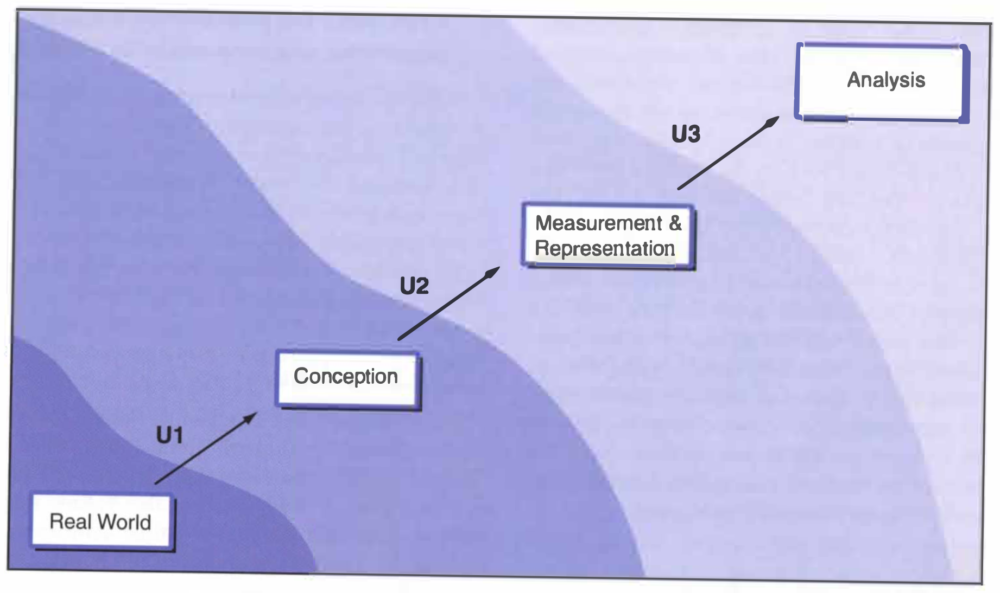

In their textbook, *Geographic Information Systems and Science*, Longle et al. illustrate the path from a real-world situation to a GIS model of that situation using Figure 6.1, which is copied below.
As you can see in the figure, the path starts in the real-world and is abstracted through a series of filters before reaching the final analysis.
Each consecutive filter (U1, U2, and U3) introduces its own error and uncertainty into the GIS model, which are amplified by downstream filters.

Although I have not conducted statistical analyses on the level of uncertainty in my GIS work, I do, simply by the virtue of practicing GIS, have some experience with uncertainty in geospatial work.
For example, in last week's lab, we used geospatial data from Open Street Map (OSM).
Open Street Map is maintained by a global community of users: anyone can input data into OSM, regardless of their level of expertise.
Since anyone can provide data, any analysis conducted on OSM data is subject to potential inaccuracies of said data.
In Human Geography with GIS, we saw evidence of other uncertainties, not the least of which is the Modifiable Areal Unit Problem (MAUP).
MAUP holds that when spatial data is aggregated into larger groups, the aggregated results hold a lot of reality at bay.
Visually, we see large swaths of land treated identically, when smaller groups would illustrate intricacies and nuance between subregions.
In every GIS analysis, even in the rudimentary analyses we conducted in introductory GIS class, there exists a certain amount of uncertainty.
Much to the geographer's chagrin, all GIS work is subject to uncertainty, because all representations of the world are inherently incomplete.

As such, geographers are responsible for (1) acknowledging and (2) reducing uncertainty in all their work, from conceptualization to measurement to GIS analysis.
In order to effectively acknowledge uncertainty in their work, geographers ought to describe the uncertainty in every published analysis.
This acknowledgement should include both qualitative descriptions of error sources and quantitative descriptions of error obtained through statistical analysis.
A combination of qualitative and quantitative descriptions of uncertainty will make it clear to readers that there are caveats and inaccuracies in every geographic analysis.
In order to actually reduce uncertainty in their work, geographers should ensure that all data used in their analysis is of high quality: this means evaluating the methods with which data was collected, obtaining information regarding the quality of the data, and ensuring that the data source is trustworthy.
When possible, using multiple sources of data tends can also reduce uncertainty, and having colleagues look over one's workflows will help catch errors in one's analyses.

**References:**

- Longley, P. A., M. F. Goodchild, D. J. Maguire, and D. W. Rhind. 2008. Geographical information systems and science 2nd ed. Chichester: Wiley.
