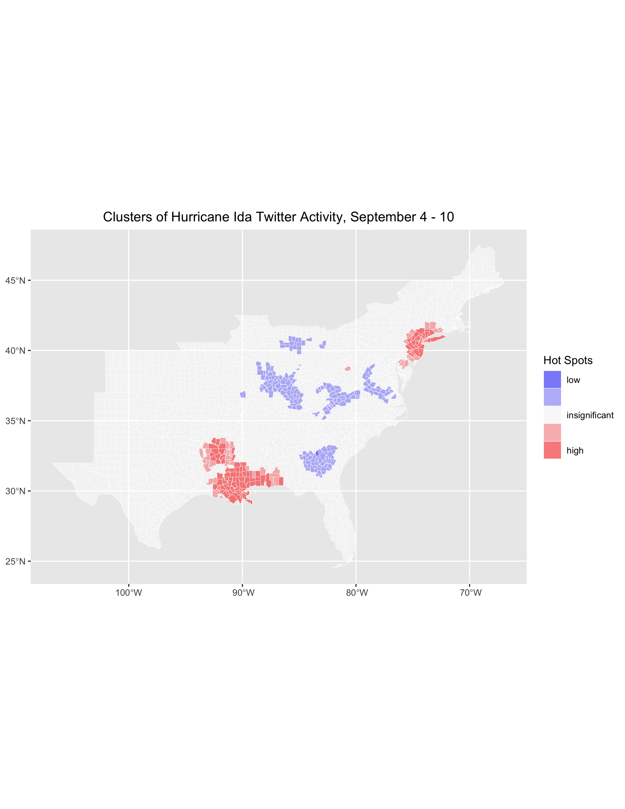

## Introduction
3. [Geographic and Sentiment Analysis of Twitter Use During Hurricane Ida](hurricane-ida-spatial-twitter-analysis)

## Materials and Methods

## Our Additions to the Code

[Replication repository](https://github.com/Liam-W-Smith/Dorian-Replication)

[Replication code](https://github.com/Liam-W-Smith/Dorian-Replication/blob/main/procedure/code/01-dorian.Rmd)

## Results and Discussion

Sentiment Analyses:

Word Network:

Hotspot Analyses:

Retweet Network:

Consider looking up the top twitter handles!

Tweets per Hour:

For more detailed information, please check out my [replication repository](https://github.com/Liam-W-Smith/Dorian-Replication).

## Conclusions
