Liam Smith, Middlebury College

Version 1.0 | Created 2021-11-28 | Last Updated 2021-11-28  


## Abstract
As social media has risen, a massive quantity of Volunteered Geographic Information has become available to the general public.
In the age of big data, researchers and corporations around the world use VGI from Twitter data to conduct research in fields from marketing to geography.
Wang et al illustrate in *Spatial, temporal, and content analysis of Twitter for wildfire hazards* that Twitter data provides valuable information about natural hazards and their impacts.
Specifically, they find that during a natural disaster, Twitter activity reflects the location and time of the disaster, as people tend to Tweet situational updates and news and local governments play a prominent role in retweet networks.
Identifying spatial, network, and content trends in Twitter activity during natural disasters is useful because it can help us formulate our responses to such disasters.
However, Crawford and Finn articulate a number of uncertainties and ethical dilemmas that accompany the use of Twitter data during natural disasters, which we ought to be wary of when conducting or reading about this kind of work.

In 2019, Professor Holler conducted an analysis of Twitter activity relating to Hurricane Dorian and the Sharpiegate scandal, seeking to identify differences between the Twitter storm and the actual storm.
He found that despite President Trump's statements that the storm would hit Alabama, the Twitter activity reflected the actual trajectory of the storm.
His analysis is available in this [Research Compendium](https://github.com/GIS4DEV/OR-Dorian).

In this investigation, I conducted a replication of his work, applying a similar methodology to Twitter data collected during Hurricane Ida.
The purpose of conducting any replication is to confirm the validity of one's methodology and the generalizability of their findings.
In this case in particular, I'm interested in confirming whether Twitter activity about a hurricane during that storm is consistently more prevalent where that storm makes landfall.
Replicating this kind of spatial research continues to be relevant as the climate crisis intensifies and hurricanes become more and more powerful.
Hurricane Ida devastated Louisiana and parts of the North East, so I anticipate finding higher levels of Twitter activity in those regions.
I will also extend the analysis in new directions by conducting a temporal analysis of Twitter hotspots, a temporal analysis of the sentiments of Tweets, and a network analysis of retweet activity.

## Study Information
In his analysis of Twitter activity during Hurricane Dorian, Professor Holler loosely replicated the methods of Wang et al, applying similar methods to a different time, place, and disaster.
Wang et al used a Twitter API to (1) query generally for tweets containing the words "fire" and "wildfire", and (2) query specifically for Tweets about wildfires in San Marcos and Bernardo, California.
They then used the tm and igraph packages in R 3.1.2 to conduct textual and network analyses on their data.
They also investigated the spatial distribution of these Tweets using a Kernal Density Estimation (KDE), but it remains unclear what computational resources they used for this last part of their analysis.
They found significant clustering of Twitter activity where the wildfires were worst, discovered that the news media and local authorities were highly prevalent in retweet networks, and learned that the contents of Tweets referenced the geographic location and damage of the disaster.

In his replication, Professor Holler used a Twitter API to query for Tweets with keywords "hurricane", "Dorian", or "sharpiegate".
He modified Wang et al's methodology by using different method to analyze the spatial clustering of Tweets.
Instead of using KDE, he created a Normalized Tweet Difference Index (NTDI) and tested for spatial culstering with the local Getis-Ord statistic.
The NTDI is calculated as *(Dorian Twitter activity - typical Twitter activity)/(Dorian Twitter activity + typical Twitter activity*, and his inspiration to use this index comes from the frequent use of other similar indices such as the Normalized Vegetation Difference Index (NVDI).
NTDI illustrates where Twitter activity is higher than the baseline and the local Getis-Ord statistic indicates where Twitter activity is significantly higher than other parts of the study area.
Professor Holler chose not to conduct a network analysis of retweet activity, focusing exclusively on Tweet content and prevalence.
The study found that despite the hysteria surrounding President Trump's claim that the storm would pass through Alabama, the Twitter data still clustered only in the affected areas of the Atlantic coast.
In his analysis, Professor Holler used R, including the rtweet, rehydratoR, igraph, sf, and spdep packages, and he provided his code for students to use in their replication studies.

## Materials and Methods
Similar to Professor Holler, I conducted my replication study using R.
Required packages include tidyverse, here, svDialogs, rtweet, rehydratoR, tidytext, tm, igraph, ggraph, tidycensus, sf, and spdep.

The Twitter data used in this analysis were collected using Twitter API searches conducted by other people.
Professor Holler conducted several searches for Tweets relating to Hurricane Ida as the disaster unfolded.
I used three of his searchers in my analysis: each search used keywords "hurricane" and "ida" and they were conducted on September 2, September 5, and September 10, 2021.
My classmate, [Castin Stone](https://stonecastin.github.io/), queried for baseline Tweets (instead of keywords he searched for "-filter:verified OR filter:verified") in November 2021, and I used his data as my control group.
I also obtained the geometry and population data of counties in the study region from the census using the tidycensus package.

You can rehydrate any of the Twitter search results using the status ID's linked below:
- [September 2 Hurricane Ida status ID's](https://github.com/GIS4DEV/OR-Ida/blob/main/data/raw/public/teventids.txt)
- [September 5 Hurricane Ida status ID's](https://github.com/GIS4DEV/OR-Ida/blob/main/data/raw/public/teventids2.txt)
- [September 10 Hurricane Ida status ID's](https://github.com/GIS4DEV/OR-Ida/blob/main/data/raw/public/teventids3.txt)
- [Baseline status ID's, November 2021](assets/control_raw.txt)

My analysis closely followed Professor Holler's methodology.
First, I combined the three Hurricane Ida search results into one table using dplyr's union function.
Then, I converted the geographic information in both the control and Hurricane Ida Twitter data to latitude and longitude coordinates, and subsetted the data to include only Tweets with sufficient geographic specificity.
I used the Hurricane Ida data to create a line graph illustrating the temporal distribution of Twitter activity, and upon cleaning the text data, I created a bar graph revealing the frequency with which unique words appeared in Tweets and a word cloud displaying the most common word pairs.
Upon spatially joining Tweets to counties, I mapped tweet hotspots using the local Getis-Ord statistic, I mapped the heightened Twitter activity using the NTDI, and I mapped the density of Tweets as the number of tweets per 10,000 residents.

I extended the analysis by mapping Tweet hotspots using the local Getis-Ord statistic over different time periods during the disaster, conducting a sentiment analysis of Tweets over those periods, and fixing bugs in the network analysis of retweet activity.
I explain my additions to the code in the following section.

## My Extensions to the Replication
To conduct my temporal analyses, I first subsetted my data into three periods of time.
The storm hit Louisiana in the last days of August and the northeast in the first days of September.
Thus, by subsetting my data into August 29-31, September 1-3, and September 4-10, I was able to evaluate the differences between when the storm hit Louisiana, when it hit the northeast, and the first few days after it dissipated.

I used this code to subset my data:

```r
time1 <- tevent_rawfull %>%
  filter(str_detect(created_at, "-08-29|-08-30|-08-31"))

time2 <- tevent_rawfull %>%
  filter(str_detect(created_at, "-09-01|-09-02|-09-03"))

time3 <- tevent_rawfull %>%
  filter(str_detect(created_at, "-09-(0[4-9]|10)"))
```

To map the Twitter hotspots using the local Getis-Ord statistic, I followed the same methodology employed by Professor Holler.
To conduct the sentiment analysis, I used some techniques that I learned in my Data Science course.
First, I queried for a sentiment lexicon entitled bing.

```r
sentiments <- get_sentiments("bing") #bing is a certain list of sentiments
sentiments
```

After cleaning the new text datasets using the same methodology as Professor Holler, I inner-joined my text datasets to the sentiment list.

```r
# Time1
time1_wordsent <- time1_words %>%
  inner_join(sentiments)

# Time2
time2_wordsent <- time2_words %>%
  inner_join(sentiments)

# Time3
time3_wordsent <- time3_words %>%
  inner_join(sentiments)
```

Finally, I graphed the most common words conveying positive and negative sentiments that appear in each time period as follows:

```r
sentiment_analysis1 = time1_wordsent %>%
  group_by(word, sentiment) %>%
  summarize(num = n()) %>%
  filter(num > 1000) %>%
  ggplot(aes(y = reorder(word, num), x = num, fill = sentiment)) +
    geom_bar(stat = "identity")+
    facet_wrap(~sentiment, scales = "free")+
    labs(title = "Hurricane Ida Comments, August 29 - 31", x = "Frequency of Usage on Twitter", y = "Words Conveying Sentiment")

sentiment_analysis2 = time2_wordsent %>%
  group_by(word, sentiment) %>%
  summarize(num = n()) %>%
  filter(num > 1000) %>%
  ggplot(aes(y = reorder(word, num), x = num, fill = sentiment)) +
    geom_bar(stat = "identity")+
    facet_wrap(~sentiment, scales = "free")+
    labs(title = "Hurricane Ida Comments, September 1 - 3", x = "Frequency of Usage on Twitter", y = "Words Conveying Sentiment")

sentiment_analysis3 = time3_wordsent %>%
  group_by(word, sentiment) %>%
  summarize(num = n()) %>%
  filter(num > 500) %>%
  ggplot(aes(y = reorder(word, num), x = num, fill = sentiment)) +
    geom_bar(stat = "identity")+
    facet_wrap(~sentiment, scales = "free")+
    labs(title = "Hurricane Ida Comments, September 4 - 10", x = "Frequency of Usage on Twitter", y = "Words Conveying Sentiment")
```

Creating a network graph is a two step process.
First, one must define the network.
In this case, I defined nodes to be each user and edges to be any retweet or quote of that user.

```r
tevent_network <- tevent_rawfull %>%
  network_graph("retweet,quote") %>%
  simplify(remove.multiple = FALSE)
tevent_network <- delete.vertices(
  tevent_network,
  degree(tevent_network, mode="in") < 1
  ) %>%
  simplify()
tevent_network <- delete.vertices(
  tevent_network,
  degree(tevent_network) < 10)
```

The second step is to graph the network in a manner that is easy to understand.
I adjusted the size of each node and the label of each node using the frequency with which each user was retweeted, drawing on Wang et al's network graph for inspiration.

```r
png("network.png", 1500, 1500)
network <- plot.igraph(
    tevent_network,
    vertex.size = degree(tevent_network)*.4,
    vertex.label = ifelse(
      degree(tevent_network) > 5,
      V(tevent_network)$name, ""),
    vertex.label.cex = degree(tevent_network)*.1,
    edge.arrow.mode = "->",
    edge.arrow.size = 0.1
  )
```

That summarizes the new intellectual work that I contributed to this replication.
If you would like to see the complete code used for this study, please [use this link](https://github.com/Liam-W-Smith/Dorian-Replication/blob/main/procedure/code/01-dorian.Rmd).
If you would like to see my entire replication repository, [click here!](https://github.com/Liam-W-Smith/Dorian-Replication)

## Results

### Replicated Figures
Tweets per Hour:
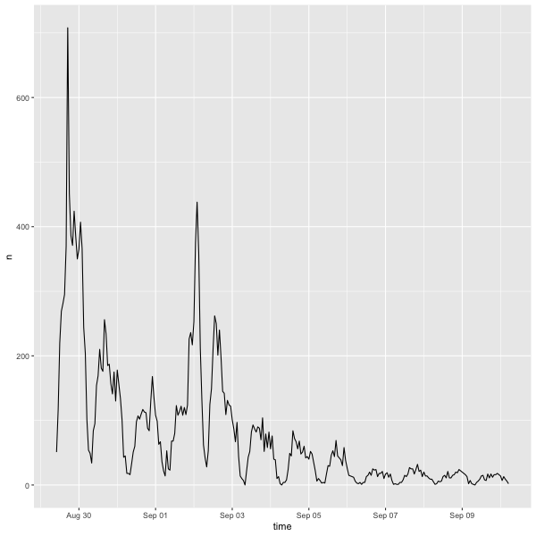

Content Analysis:
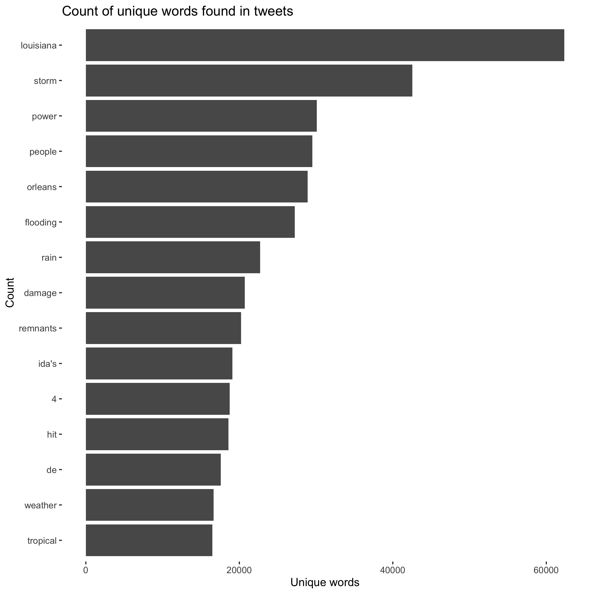

Word Network:
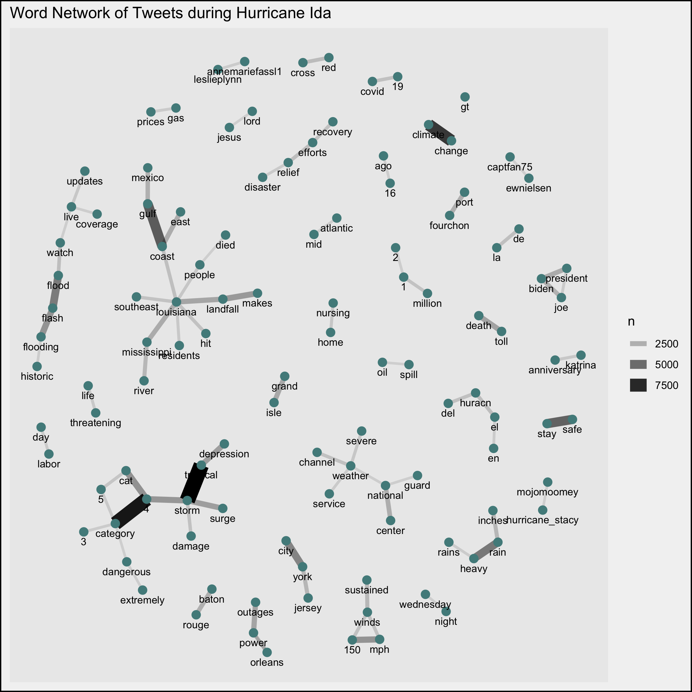

Map of Increased Twitter Activity (NTDI):
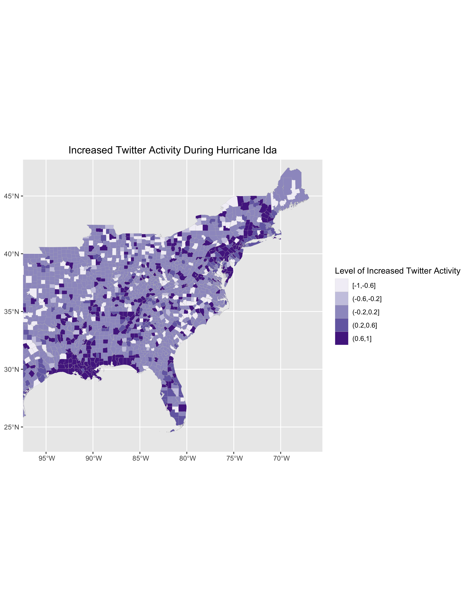

Hotspot Analysis:
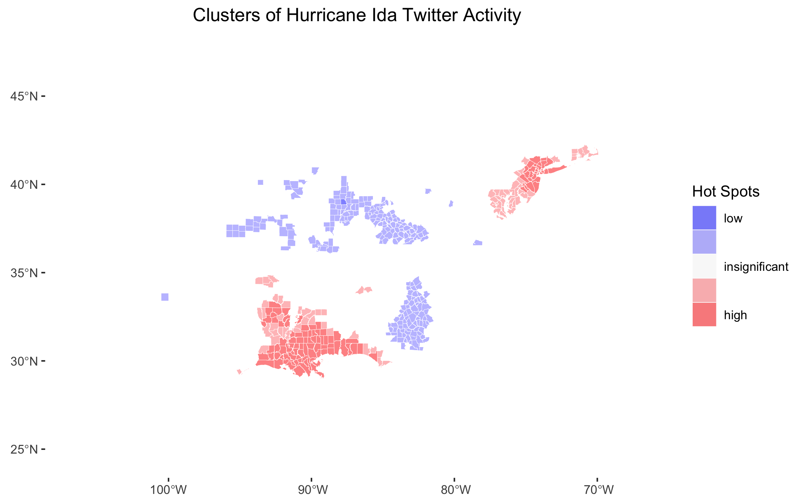

### My Additions
Hotspot Analyses:
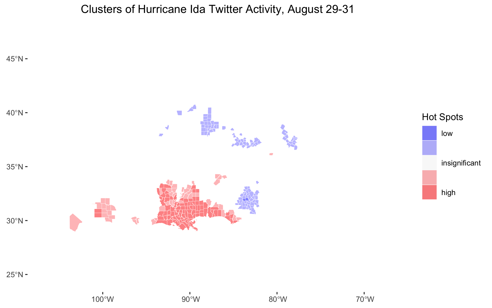
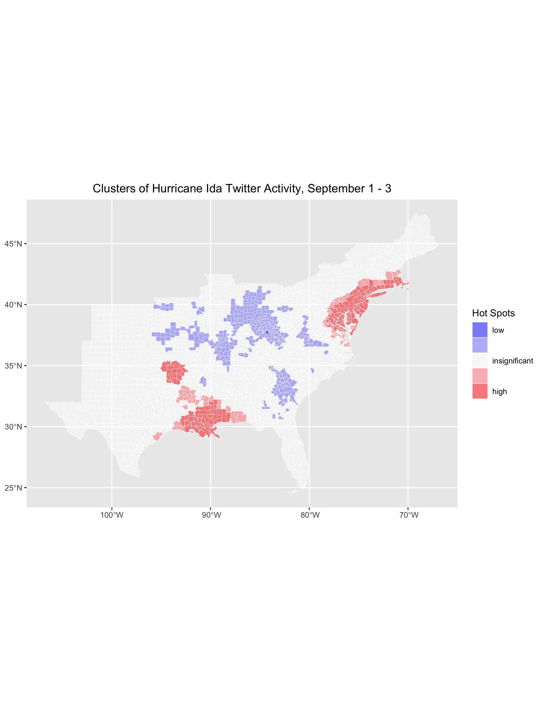
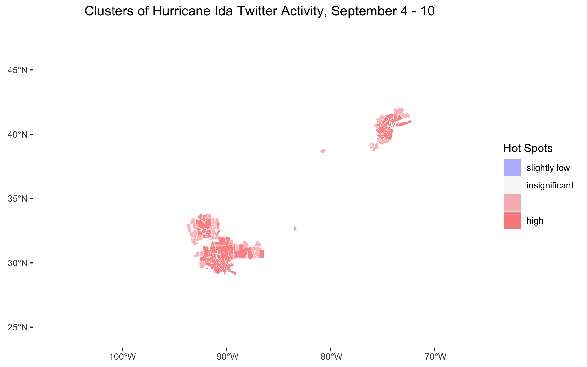

Sentiment Analyses:
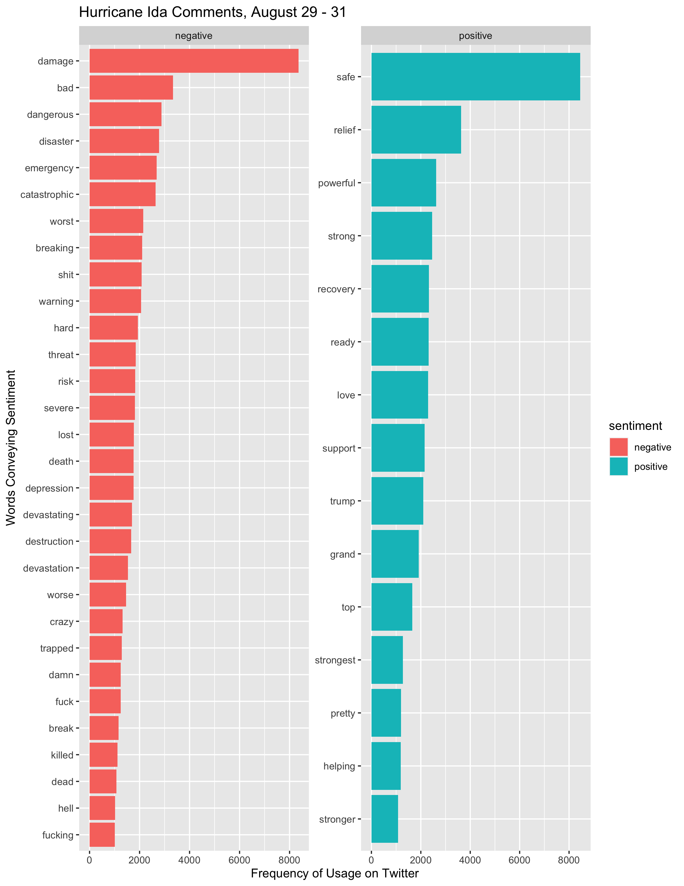
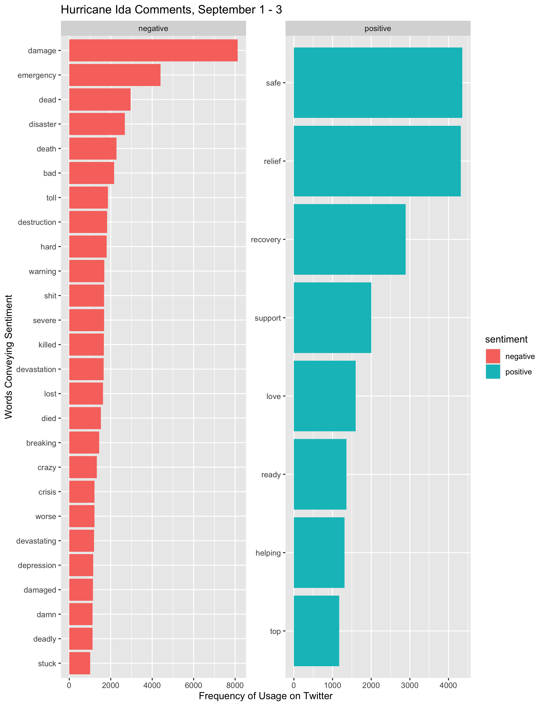
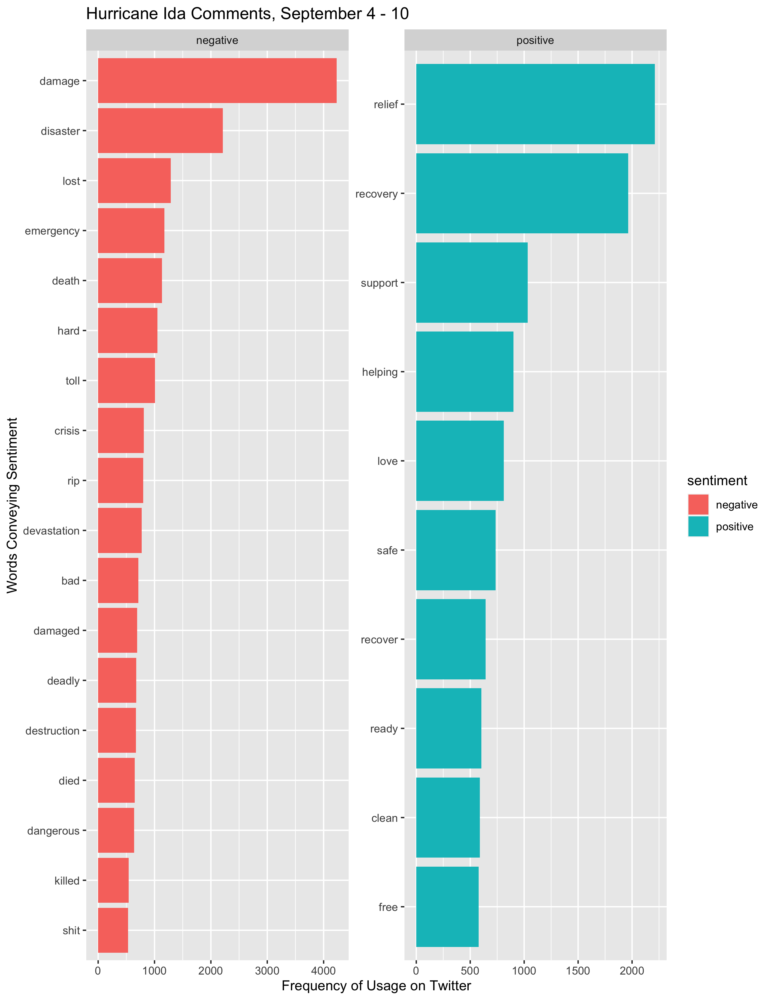

Retweet Network:
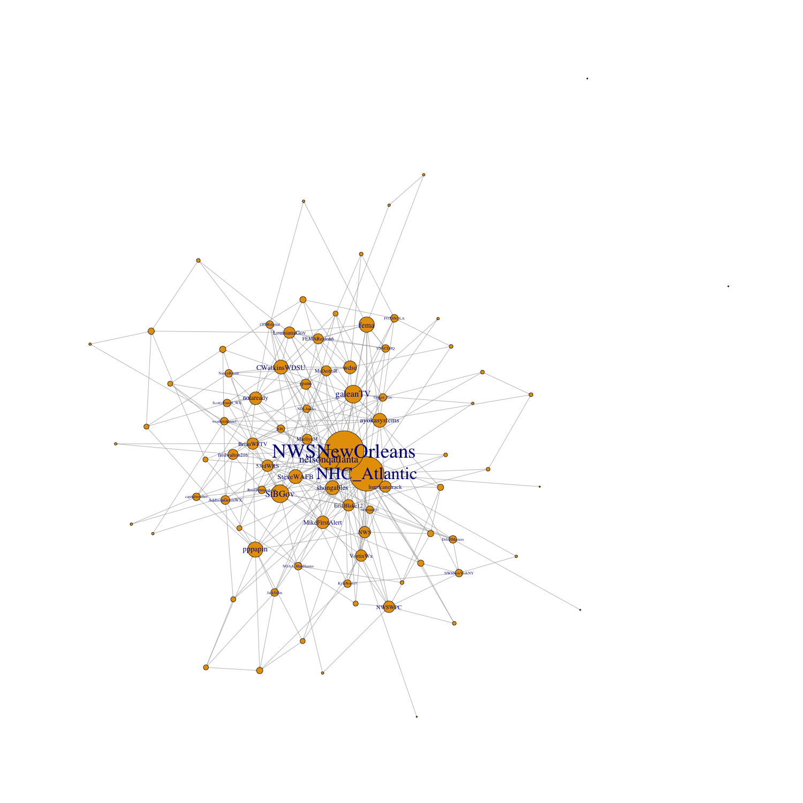

For more detailed information, please check out my [replication repository](https://github.com/Liam-W-Smith/Dorian-Replication).

((((((Try theme_void or look up how to make graphs without backgrounds.

Try side by side images in tables. Or merge the images into one image....

Do some googling!))))))

## Discussion
The report discussion should compare your results to our Hurricane Dorian study and Wang et al (2016) and respond to any relevant concerns of Crawford and Finn (2014).
Provide a summary and interpretation of your key findings in relation to your research question. Mention if findings confirm or contradict patterns observed by Wang et al (2016) or by Holler
- Consider looking up the top twitter handles!

## Conclusions
Restate the key findings and discuss their broader societal implications or contributions to theory. Do the research findings suggest a need for any future research?


**References**
- Crawford, K., & Finn, M. (2015). The limits of crisis data: Analytical and ethical challenges of using social and mobile data to understand disasters. GeoJournal, 80(4), 491–502. https://doi.org/10.1007/s10708-014-9597-z
- Professor Holler's [Research Compendium](https://github.com/GIS4DEV/OR-Dorian) for his analysis of Hurricane Dorian
- Wang, Z., Ye, X., & Tsou, M.-H. (2016). Spatial, temporal, and content analysis of Twitter for wildfire hazards. Natural Hazards, 83(1), 523–540. https://doi.org/10.1007/s11069-016-2329-6
- Past replications!
