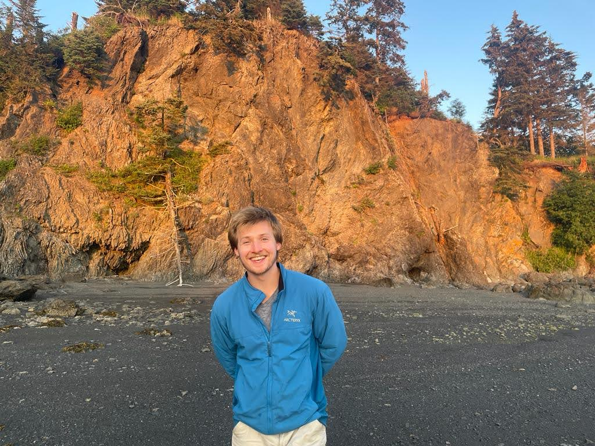

| Hey! My name is Liam and I'm a senior at Middlebury College studying geography and mathematics. This website documents the work I've done in [GEOG 323: Open Source GIScience](https://gis4dev.github.io/). If you're interested in seeing my remote sensing work, please [click here](https://sites.middlebury.edu/lwsmithremotesensing/) |  |

## GIS Analyses
1. [Flood Risk and Food Access in Dar Es Salaam](/Dar-Es-Salaam-Vulnerability/report)
2. [Spatial Accessibility of COVID-19 Healthcare Resources in Chicago](COVID-19-spatial-accessibility)
3. [Hurricane Ida Spatial Twitter Analysis](hurricane-ida-spatial-twitter-analysis)
4. [Final Project: Replication Study using Geographically Weighted Regression](dental-gwr)

## Blog Posts

1. [Is GIS a Science?](open-giscience)
2. [The Role of Open Source GIS in Resolving the Reproducibility Crisis](Reproducibility-crisis)
3. [Error and Uncertainty](error-and-uncertainty)
4. [Research Compendia as a Tool to Learn Spatial Analysis](Research-Compendium-Learning-Spatial-Analysis)
5. [Understanding Uncertainty in Vulnerability Indices](vulnerability_and_uncertainty)
6. [Uncertainty in Volunteered Geographic Information](VGI-Uncertainty)
7. [Reproducing Chakraborty's Analysis of COVID-19 and Disability Characteristics](chakraborty-reproduction)
