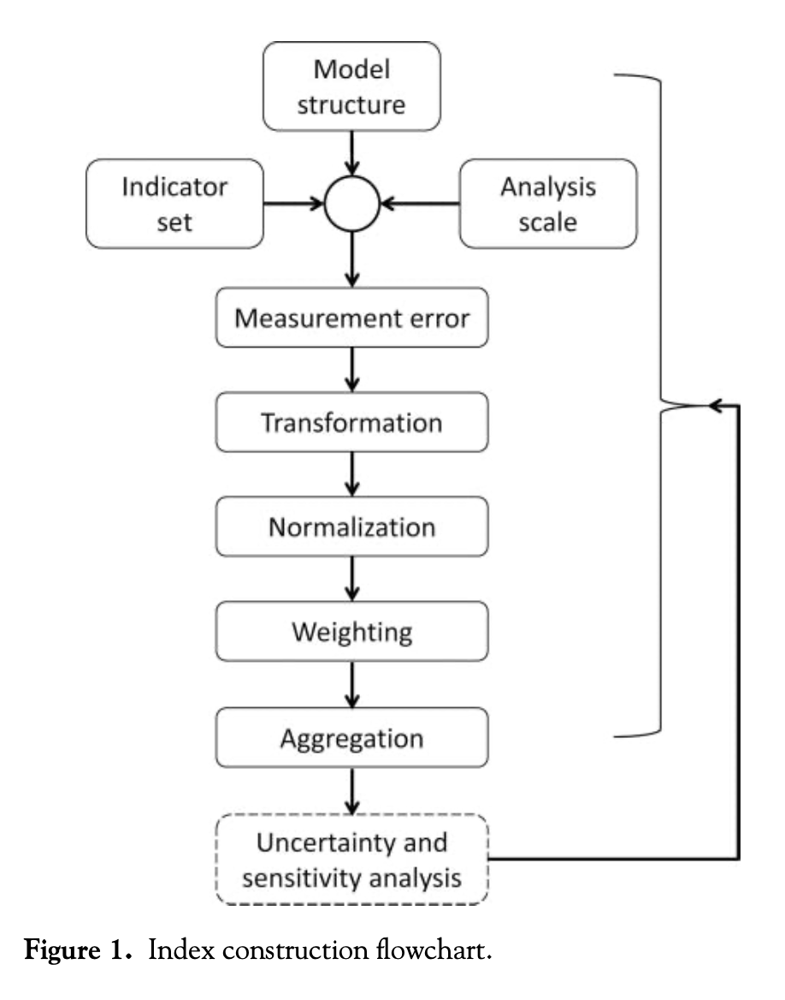
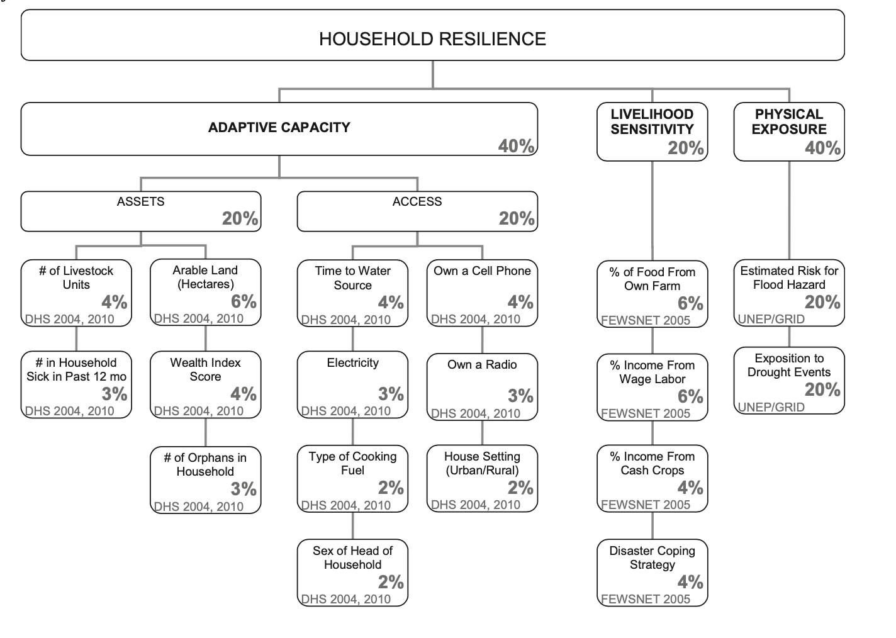

A vulnerability index is a measure of the risk that some hazard poses to different areas.
These indices consider and weight a number of factors based on how significantly they impact a region's susceptibility to that hazard.
In *Uncertainty Analysis for a Social Vulnerability Index*, Eric Tate articulates a framework for designing and evaluating vulnerability indices, and in *Vulnerability modeling for sub-Saharan Africa: An operationalized approach in Malawi*, Malcomb et al present an index assessing the vulnerability of different parts of Malawi to climate change.
In this post, I seek to critique Malcomb et al's work in the context of Tate's framework.

According to Tate, the construction of a vulnerability index includes a series of 9 steps, which are conducted in the order indicated by the flowchart below.
In what follows, I will describe each stage of the process individually and point out areas where Malcomb et al could improve their work.

**Model structure:** this is the first stage of the process, in which the index developer decides whether to follow a *deductive*, *hierarchical*, or *inductive* design.
*Deductive* designs are based on theory and typically include 10 or fewer normalized variables.
*Hierarchical* designs are similar; they typically include a greater number of indicators, which are also chosen based on theory, and which are grouped into subindices.
Both deductive and hierarchical models depend on expert opinion and critical thought, so there is no internal proof of validity.
*Inductive* designs are more robust, using data and statistical/regression analysis to decide which variables are more indicative of the outcome of interest.
Malcomb et al opt for a hierarchical design of 18 variables organized into three subindices as outlined below:

**Indicator set:** the way in which one selects their indicators greatly impacts the validity of their vulnerability index, as certain methods are more likely to introduce bias and error than others.
*Deductive* methods select indicators based on theory; *normative* methods rely on value judgements and expert opinion; *inductive* methods rely on data and statistical analysis of real-world results; *non-substantial* methods rely on the characteristics of data alone; and *practical* methods select indicators based on what one can access and afford.

Malcomb et al rely heavily on the normative method, conducting an extensive process of interviews with locals in Malawi.
In their paper, they also cite a number of studies on the validity of their indicators, which leads me to believe that they cross-checked the feedback from Malawians with academic work on the issue.
On one hand it makes sense to hear from locals and experts about the factors influencing their day-to-day lives, but on the other hand, the normative method inherently introduces bias into their model.
A more robust method would involve some statistical analysis of their indicators.
Malcomb et al also take advantage of the practical method, because data with sufficient spatial granularity is seldom found in Sub-Saharan Africa.
For example, the authors use a global dataset from UNEP/GRID on flood and drought risk in Malawi, in which the rasters are given in a global Coordinate Reference System with large cell sizes.
A more substantial search for indicators might have considered methods to create more granular rasters.

**Analysis scale:** this step occurs simultaneously with the previous step, and refers to the selection of an appropriate geographic scale for the analysis.
For one map, Malcomb et al select an analysis level of Traditional Authority, a level of government responsible for some degree of resilience planning and disaster relief.
While it makes sense to conduct a vulnerability analysis at the appropriate government subdivision, the methodology employed to transform the data to the Traditional Authority level introduces substantial error.
DHS household data is given at a so-called "cluster" level, where households corresponding to a certain cluster are located within 5 km of the point representing that cluster.
Data is spatially aggregated from the cluster level to the Traditional Authority level, but since households are within 5 km of the clusters, they are not all actually within the Traditional Authorities that the clusters aggregate into.

For another set of maps, Malcomb et al rasterize all of their layers to the cell size of the smallest raster.
This process, in which the authors use more general data to generate more specific data, introduces substantial uncertainty, because it assumes that every subsection of a given cell is identical.
Fundamentally, one cannot go from simplified data to more complex data without ignoring critical  nuances of reality.

**Measurement error:** as discussed in my previous blog post, [Error and Uncertainty](error-and-uncertainty), measurement error propogates through one's analysis.
There are numerous examples of measurement error in this study, but for the sake of time I will address just one of them.
One gaping measurement error in Malcomb et al's analysis stems from the "Exposition to Drought Events" indicator, which the authors assume represents the likelihood that an area will be affected by drought.
Upon reviewing the metadata for that raster, it becomes apparent that the layer is not a measure of a region's exposition to drought, but rather an estimation of the population in each grid that is exposed to drought annually.
Using population-based drought data is a flawed approach, because it exaggerates the perceived drought risk for cities and reduces the perceived drought risk for rural areas.

**Transformation:** after measuring data, one must decide how to transform their data to be suitable for analysis.
Generally speaking, it is best practice to represent vulnerability with relative proportions of individuals at risk rather than total populations, because simple counts exaggerate the vulnerability for urban areas.
Unfortunately, Malcomb et al fail to transform a number of their indicators before applying their weighted sum.
For example, they consider the number of orphans in each household, when it might be more meaningful to consider the proportion of individuals in each household who are orphans.

**Normalization:** In order to adjust for the fact that different variables have different units and scales, one must normalize their indicators onto a common scale before considering them together.
One popular method of scaling is called linear scaling, which uses the following formula to assign every observation a value between 0 and 1: (observation - min)/(max - min).
Another method of scaling uses the z-score, calculated as (observation - mean)/(standard deviation).
Additionally, some indicators in a vulnerability index may exhibit a trend that represents the opposite of vulnerability; that is, when the value of that indicator increases, the vulnerability of an area decreases.
Indicators like this ought to undergo a directionality adjustment before normalization.
Directionality adjustments typically involve multiplying by -1 or taking the reciprocal of each value.

In their study, Malcomb et al apply linear scaling to each of their indicators, which works just fine for their quantitative variables.
However, some of their indicators (sex of household head, the type of cooking fuel, the urban/rural setting, etc) are not quantitative.
How does one take a categorical or binary variable and convert it onto a scale from 0 to 5?
It does not make sense to transform a simpler class of data into a more complex one, and it is not clear how the authors accomplished that.
Malcomb et al also provide no information about directionality adjustments, leaving their work irreproducible and slightly ambiguous.

**Weighting:** perhaps the most subjective decision when designing a vulnerability index is how one selects which weights to apply to each indicator.
Malcomb et al again apply a normative strategy for selecting weights, relying on interviews with Malawians to determine which factors most greatly impact one's vulnerability to climate change.
It is difficult to assess the validity of their weighting without having conducted the interviews in Malawi myself (the authors do not provide any of the interview content), but I would feel more comfortable with their weights had the authors employed some statistical analysis during the selection process.

**Aggregation:** this stage refers to the method one uses to combine all of their indicators into a single index.
The most common method of aggregation, and the method employed by Malcomb et al, is known as *additive aggregation*, which is implemented as a weighted sum of the indicators.
Additive aggregation considers each indicator invidually, ignoring any interaction between indicators, and it is considered a substitutable method, because an especially high value of one indicator can mask low values of other indicators.
Other methods of aggregation account better for interaction effects and substitution, but it is unclear whether the authors of the paper considered these methods during their work.

**Uncertainty and sensitivity analysis validation:** in the final step of index construction, one identifies and reduces uncertainty in the model's assumptions.
Unfortunately, this step is often neglected in vulnerability analyses, as it is in Malcomb et al's work.
This blog post qualitatively identifies several sources of error and uncertainty, which the authors could consider in an evaluation of their methodology.
A more formal uncertainty and sensitivity analysis ought to employ mathematical methods like Monte Carlo simulations to assess the validity of their index.

This brings us to the conclusion of the index construction process.
Inspecting each step individually has revealed numerous ways in which a vulnerability model is subject to uncertainty, and evaluating Malcomb et al's work in the context of this framework has illustrated a number of shortcomings of their work.
In conclusion, index developers ought to think critically about uncertainty as they craft their models and take time to validate their model after the fact.

**References:**

- Malcomb, D. W., Weaver, E. A., & Krakowka, A. R. (2014). Vulnerability modeling for sub-Saharan Africa: An operationalized approach in Malawi. Applied Geography, 48, 17–30. [https://doi.org/10.1016/j.apgeog.2014.01.004](https://doi.org/10.1016/j.apgeog.2014.01.004)

- Tate, E. (2013). Uncertainty Analysis for a Social Vulnerability Index. Annals of the Association of American Geographers, 103(3), 526–543. [https://doi.org/10.1080/00045608.2012.700616](https://doi.org/10.1080/00045608.2012.700616)

- Hinkel, J. (2011). “Indicators of vulnerability and adaptive capacity”: Towards a clarification of the science–policy interface. Global Environmental Change, 21(1), 198–208. [https://doi.org/10.1016/j.gloenvcha.2010.08.002](https://doi.org/10.1016/j.gloenvcha.2010.08.002)

- [Metadata for Drought Risk Raster](assets/drought_physical_exposure copy.pdf)
